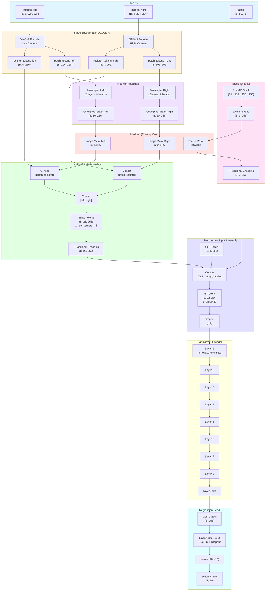

# Multimodal Force Transformer Architecture

## Mermaid Diagram

## Architecture Details

### Token Composition (DINOv3)
- **CLS Token**: 1 token (learnable)
- **Left Camera**: 10 patch tokens + 4 register tokens = 14 tokens
- **Right Camera**: 10 patch tokens + 4 register tokens = 14 tokens
- **Tactile Tokens**: 3 tokens
- **Total**: 1 + 14 + 14 + 3 = **32 tokens**

### Transformer Configuration
- **Layers**: 8 (updated from 4)
- **d_model**: 256
- **nhead**: 8
- **dim_feedforward**: 512
- **dropout**: 0.1
- **Activation**: GELU
- **Norm**: LayerNorm (pre-norm architecture)

### Masking Strategy
- **Image Mask Ratio**: 0.5 (50% of patch tokens masked)
- **Tactile Mask Ratio**: 0.3 (30% of tactile tokens masked)
- **Masking**: Only during training (`self.training == True`)
- **Mask Tokens**: Learned parameters (separate for image and tactile)

### Action Chunking
- **Output Size**: 10 future steps
- **Shape**: `(batch, 10)`
- **Meaning**: Predicts gripper position deltas for next 10 timesteps

### Key Components

1. **DINOv3 Image Encoder**
   - Frozen backbone (`freeze_backbone=True`)
   - Outputs: 196 patch tokens + 4 register tokens
   - Hidden size: 256 (projected from DINOv3's hidden size)

2. **Perceiver Resampler**
   - Compresses 196 patch tokens → 10 latent tokens
   - 2 cross-attention layers
   - 8 attention heads
   - Learnable latent queries

3. **Tactile Encoder**
   - Conv1D stack: 6 → 64 → 128 → 256 → 256
   - Adaptive pooling to 3 tokens
   - Processes temporal sequences (500 timesteps → 3 tokens)

4. **Transformer Encoder**
   - 8 layers of self-attention
   - Processes all tokens together (CLS + image + tactile)
   - Pre-norm architecture (LayerNorm before attention/FFN)

5. **Regression Head**
   - Takes CLS token output
   - 2-layer MLP: 256 → 128 → 10
   - Outputs action chunk (10 future deltas)
